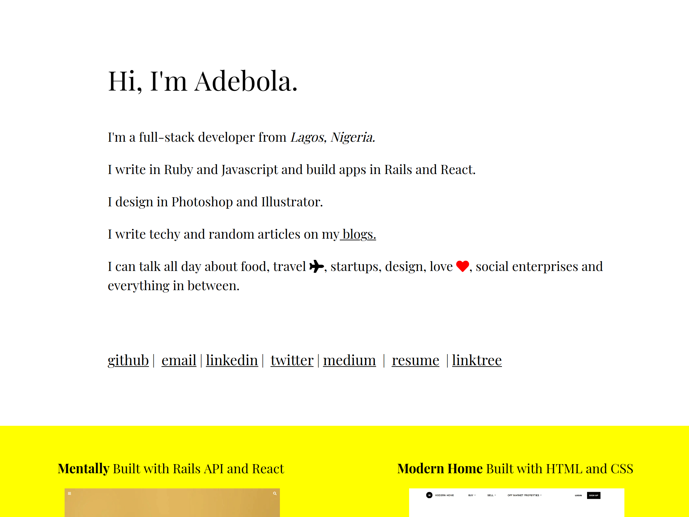

# Portfolio

> Original portfolio written in HTML and CSS.



## Built With
- HTML
- CSS

## Live

[Live Link](https://onedebos.github.io/my-portfolio/)

## Getting Started

**To get started, follow the instructions below**

To get a local copy up and running follow these steps.

- git clone this repo

```
git clone https://github.com/onedebos/my-portfolio.git
```

- cd into the folder
- start your live-server

## Author

👤 **Adebola**

- Github: [@githubhandle](https://github.com/onedebos)
- Twitter: [@twitterhandle](https://twitter.com/debosthefirst)
- Linkedin: [linkedin](https://www.linkedin.com/in/adebola-niran/)
- Portfolio: [Website](https://elegant-borg-4081b7.netlify.com/#)

## 🤝 Contributing

Contributions, issues and feature requests are welcome!

Feel free to check the [issues page](issues/).

## Show your support

Give a ⭐️ if you like this project!

## 📝 License

This project is [MIT](lic.url) licensed.
